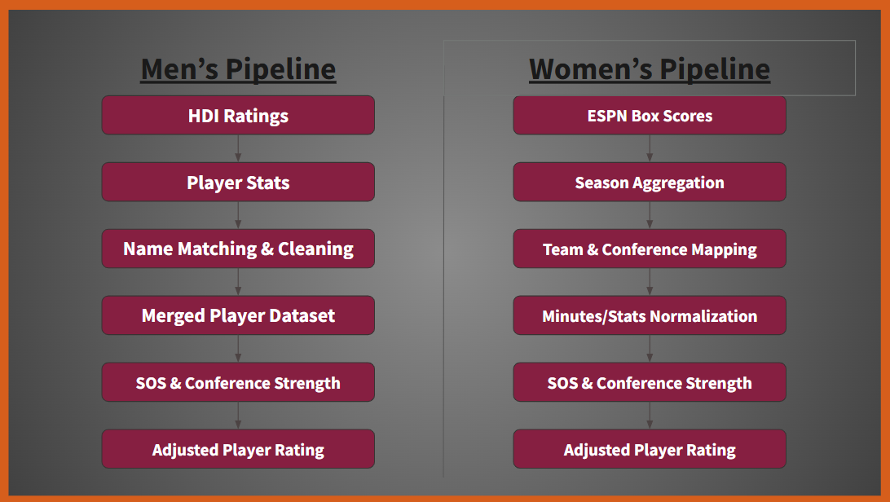

# Context-Aware 2K-Style Ratings for NCAA Basketball

This project builds a context-aware player rating system for NCAA men’s and women’s basketball. The goal is to convert box-score production, team strength, schedule difficulty, and conference context into 2K-style player ratings on a 40–99 scale.

## Pipeline Diagram

## Project Overview

Raw player statistics can be misleading because they do not account for role, team context, opponent strength, or conference environment. A player putting up strong numbers in a lower-major conference may not be directly comparable to a player producing less in a high-major setting.

This project attempts to make that comparison more reasonable by combining:

- Player box-score production
- Team strength
- Schedule difficulty
- Conference strength
- Role/statistical adjustments
- Final 2K-style rating scaling

## Data Sources

- Bart Torvik men’s college basketball player statistics
- HDI men’s basketball ratings used as a modeling baseline
- ESPN women’s basketball box scores through `wehoop`
- ESPN men’s basketball schedules through `hoopR`
- Manually created team and conference mapping files

## Tools Used

- R
- tidyverse
- randomForest
- caret
- hoopR
- wehoop
- cbbdata
- R Markdown

## Methodology

The men’s rating pipeline uses Bart Torvik player statistics joined with HDI ratings. A random forest model is trained to estimate player rating from box-score and efficiency statistics. Those ratings are then adjusted using role-based statistical corrections and conference-strength context.

The women’s pipeline uses ESPN box-score data from `wehoop`. Player statistics are aggregated to the season level, normalized into a comparable format, and passed through the rating model. Additional adjustments account for role differences, team strength, schedule difficulty, and conference environment.

Final ratings are scaled to a 40–99 range to resemble a 2K-style rating system.

## Key Outputs

- Final men’s 2025 player ratings
- Final women’s 2025 player ratings
- Conference-adjusted rating outputs
- Conference strength and schedule context tables
- Final written report
- Final presentation deck
- Pipeline diagram

## File Guide

- `scripts/01_create_base_ratings.R`: creates raw and role-adjusted men’s/women’s ratings
- `scripts/02_apply_conference_adjustment.R`: applies conference adjustments and creates final ratings
- `scripts/03_build_mbb_conference_strength.R`: estimates men’s team and conference strength from schedule results
- `scripts/04_build_wbb_dataset.Rmd`: builds the women’s basketball player dataset and context files
- `R/join_hdi_ratings.R`: helper function for matching Bart Torvik player rows to HDI ratings
- `R/clean_team_names.R`: helper function for standardizing team names
- `data/final/`: final public-facing rating outputs
- `data/intermediate/`: intermediate model outputs
- `data/context/`: conference and team strength context files
- `data/mappings/`: manually created team/conference mapping files
- `reports/`: final report and presentation
- `assets/`: project visuals, including the pipeline diagram

## Reproducibility Note

This portfolio version is partially reproducible. Some original HDI source files are not included because they came from a private/class-provided data source. The cleaned repo includes final outputs, helper scripts, mapping files, and public-source workflow code where possible, but fully reproducing the men’s model from scratch requires access to the original HDI rating files.

## Limitations

- The model relies heavily on box-score data and does not capture off-ball impact, screening, spacing, or detailed defensive value.
- The women’s model required adaptation because equivalent HDI-style ratings were not available.
- Conference adjustments can be unstable for smaller conferences with limited cross-conference data.
- The model was developed and evaluated on one season, so future-season transferability is not fully tested.
- Final ratings should be treated as a decision-support tool, not a definitive player ranking system.
